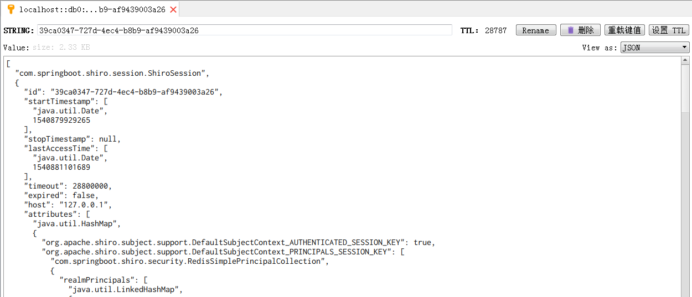

# springboot-shiro

基于spring boot,shiro,mybatis(使用mybatis-plus)的简易的一个后台权限模块,只包含权限部分

前端展示配合 [react-authority](https://github.com/ztgreat/react-authority)

此外 另一个权限[springboot-security](https://github.com/ztgreat/springboot-security) 项目使用spring security 重写了权限部分，从功能上来说是一致的

## shiro

基于资源的访问控制（实质也是角色访问控制），根据请求资源，判断用户是否拥有该资源，进而判断是否允许用户访问，前端使用ant-design-pro来简单的实现，并没有很完善化，可以具体到某个action,展示界面未到按钮级别进行控制。

### 菜单管理

### 资源权限

### 角色管理

可以给每个角色分配菜单和资源

### 角色分配

## session

将用户session 已json字符串的方式 放入redis 中，shiro session 没法直接json序列化到redis，项目中做了一些调整和修改

